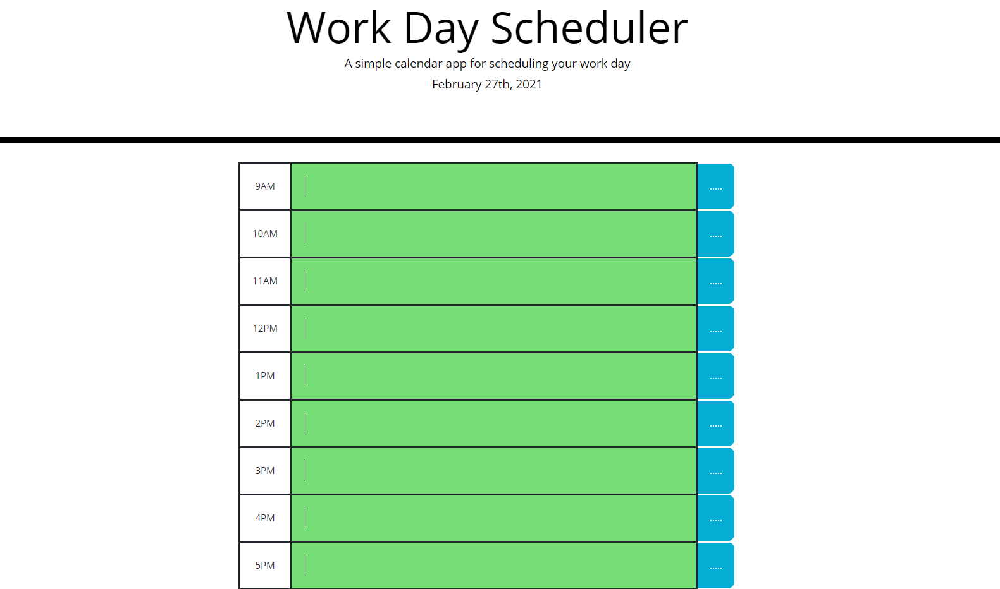

# Work_Day_Scheduler
This is a work day scheduler where the user can input anything in the text area in the middle section. The purpose of this website is to help the user to write down the note as a reminder of what activity they should be doing based on the hour they chooses.

The user will choose what to write down between 9am to 5pm. After the user has written down their notes, they can click the blue box to save their notes. By saving the notes, the website will display all the notes which have been saved even when the page is re-freshed or re-opened.

